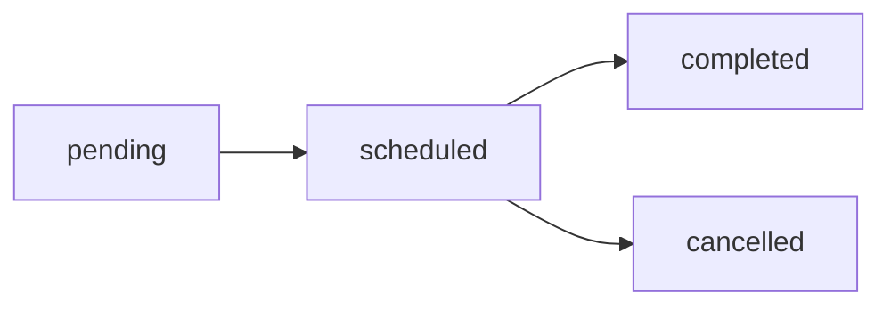

The class management system allows administrators to oversee all virtual English classes, assign learning activities, and track student progress.

## Viewing All Classes

The main admin dashboard displays all virtual classes in the system.

### Class Data Structure

Each virtual class contains:

<ParamField path="id" type="string">
  Unique MongoDB ObjectId for the class
</ParamField>

<ParamField path="googleEventId" type="string">
  Google Calendar event ID for synchronization
</ParamField>

<ParamField path="bookedById" type="string">
  User ID of the class host/organizer
</ParamField>

<ParamField path="accessCode" type="string">
  8-character random code for class access
</ParamField>

<ParamField path="startTime" type="DateTime">
  Class start date and time
</ParamField>

<ParamField path="endTime" type="DateTime">
  Class end date and time
</ParamField>

<ParamField path="classType" type="enum">
  Either `individual` or `grupal` (group class)
</ParamField>

<ParamField path="maxParticipants" type="number">
  Maximum number of students allowed
</ParamField>

<ParamField path="currentParticipants" type="number">
  Current number of enrolled students
</ParamField>

<ParamField path="status" type="enum">
  Class status: `scheduled`, `pending`, `completed`, or `cancelled`
</ParamField>

<ParamField path="activityStatus" type="enum">
  Activity assignment status: `uploaded` or `pending`
</ParamField>

<ParamField path="htmlLink" type="string">
  Google Meet link for the virtual class
</ParamField>

**Schema Reference:** `prisma/schema.prisma:130-153`

## Filtering Classes

Administrators can filter classes by status:

### Filter Options

1. **Scheduled Classes** (`?status=scheduled`)
   - Shows upcoming and active classes
   - Classes with status "scheduled"

2. **Completed Classes** (`?status=completed`)
   - Historical classes that have finished
   - Useful for analytics and reporting

3. **All Classes** (default)
   - Displays every class regardless of status
   - Sorted by start time (descending)

### Implementation

**Server Action:** `src/app/(dashboard)/admin/actions.ts:6-20`

```typescript
export const getAllClasses = cache(async () => {
  try {
    const response = db.virtualClass.findMany({
      orderBy: {
        startTime: 'desc'
      }
    })
    return response
  } catch (error) {
    console.error('We could not retrieve the classes at this time', error)
  }
})
```

<Note>
  The `getAllClasses` function uses React's `cache()` to optimize performance. Results are cached and don't change with URL parameters.
</Note>

## Creating Activities

Administrators can create AI-powered learning activities for any scheduled class.

### Activity Assignment Workflow

1. Navigate to `/admin/actividad/[classId]`
2. Fill out the activity creation form
3. Submit to generate and assign the activity
4. Students receive access to the activity after class completion

### Activity Form Fields

<ParamField path="classId" type="string" required>
  Virtual class ID (auto-populated, read-only)
</ParamField>

<ParamField path="title" type="string" required>
  Title of the exam or activity
</ParamField>

<ParamField path="description" type="string" required>
  Detailed description and instructions for the activity
</ParamField>

<ParamField path="difficulty" type="enum" required>
  Difficulty level: `easy` (inicial), `medium` (intermedio), or `hard` (avanzado)
</ParamField>

<ParamField path="type" type="enum" required>
  Activity type:
  - `exam` - Written examination
  - `audio` - Listening comprehension
  - `video` - Video-based activity
  - `reading` - Reading comprehension
</ParamField>

<ParamField path="content" type="string (Markdown)" required>
  Activity content in Markdown format (unsolved version)
</ParamField>

<ParamField path="solvedContent" type="string (Markdown)" required>
  Answer key/solved version in Markdown format
</ParamField>

**Form Implementation:** `src/app/(dashboard)/admin/actividad/[classId]/page.tsx:44-150`

## Activity Upload Process

When an activity is uploaded:

### Step 1: Create Task

```typescript
const newTask = await db.task.create({ data })
```

A new `Task` record is created with the activity content.

### Step 2: Update UserActivity

All participants in the class receive the activity:

```typescript
await db.userActivity.updateMany({
  where: {
    classId: classFound.id
  },
  data: {
    taskId: newTask.id,
    completed: false
  }
})
```

### Step 3: Mark Activity as Uploaded

```typescript
await db.virtualClass.update({
  where: { id: classFound?.id },
  data: {
    activityStatus: 'uploaded'
  }
});
```

### Step 4: Increment Class Counter

Student total class count is incremented:

```typescript
await db.user.updateMany({
  where: {
    id: { in: userIds }
  },
  data: {
    totalClasses: { increment: 1 }
  }
})
```

**Full Implementation:** `src/app/(dashboard)/admin/actividad/[classId]/actions.ts:20-117`

<Warning>
  Activities can only be assigned once per class. After an activity is uploaded, the status changes from "Pendiente" (Pending) to "Enviada" (Sent) and the button is disabled.
</Warning>

## Class Participants

### Adding Participants

Users can join classes using an access code. The system handles:

- **Duplicate Prevention:** Checks if user is already enrolled
- **Capacity Management:** Enforces `maxParticipants` limit
- **Role Assignment:** Distinguishes between host (`anfitrion`) and participants (`participante`)

**Function:** `src/services/functions/index.ts:280-335`

### Participant Tracking

The `participantsIds` array stores all enrolled user IDs:

```typescript
participantsIds: {
  push: userId
}
```

And current count is incremented:

```typescript
currentParticipants: {
  increment: 1
}
```

## Class Status Management

### Status Workflow



1. **pending** - Initial state after booking
2. **scheduled** - After payment approval and calendar event creation
3. **completed** - Class has finished
4. **cancelled** - Class was cancelled

**Enum Definition:** `prisma/schema.prisma:35-40`

## Access Codes

Each class receives a unique 8-character access code:

```typescript
const randomCode = Math.random().toString(36).substring(2, 10).toUpperCase();
```

Students use this code to join group classes.

**Implementation:** `src/services/functions/index.ts:187`

## Google Meet Integration

Classes are automatically connected to Google Meet:

- Meet links are stored in `htmlLink` field
- Links are generated when calendar events are created
- Synchronized with Google Calendar via admin's refresh token

See [Calendar Setup](/admin/calendar-setup) for configuration details.

## Related Features

<CardGroup cols={2}>
  <Card title="User Activity Tracking" icon="chart-line">
    Monitor student progress through the `UserActivity` model
  </Card>
  <Card title="Payment Integration" icon="credit-card" href="/admin/payment-integration">
    Classes are created after successful payment
  </Card>
</CardGroup>