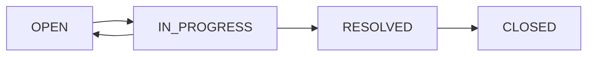

The support ticket system provides a structured way for users to report issues and communicate with administrators.

## Ticket Data Model

Tickets are stored in MongoDB using the `SupportTicket` schema.

### SupportTicket Schema

<ParamField path="id" type="string">
  MongoDB ObjectId - unique ticket identifier
</ParamField>

<ParamField path="userId" type="string" required>
  Reference to the user who created the ticket
</ParamField>

<ParamField path="ticketNumber" type="string" required>
  Unique, human-readable ticket identifier (e.g., "TKT-ABC123")
</ParamField>

<ParamField path="description" type="string" required>
  Initial description of the issue or request
</ParamField>

<ParamField path="category" type="string" required>
  Ticket category (e.g., "BUG", "PAGOS", "CUENTA", "GENERAL")
</ParamField>

<ParamField path="status" type="enum" default="OPEN">
  Current ticket status
</ParamField>

<ParamField path="priority" type="enum" default="MEDIUM">
  Ticket priority level
</ParamField>

<ParamField path="messages" type="TicketMessage[]">
  Array of messages in the ticket conversation
</ParamField>

**Schema Reference:** `prisma/schema.prisma:205-217`

## Ticket Status Workflow

Tickets progress through different statuses:

### Status Types

<ParamField path="OPEN" type="status">
  Newly created ticket, awaiting review
</ParamField>

<ParamField path="IN_PROGRESS" type="status">
  Administrator is actively working on the ticket
</ParamField>

<ParamField path="RESOLVED" type="status">
  Issue has been solved, awaiting closure
</ParamField>

<ParamField path="CLOSED" type="status">
  Ticket is permanently closed
</ParamField>

**Enum Definition:** `prisma/schema.prisma:81-86`

### Status Workflow



## Ticket Priority Levels

Tickets can be prioritized for triage:

### Priority Types

<ParamField path="LOW" type="priority">
  Low priority - minor issues, feature requests
</ParamField>

<ParamField path="MEDIUM" type="priority">
  Medium priority (default) - standard support requests
</ParamField>

<ParamField path="HIGH" type="priority">
  High priority - significant issues affecting user experience
</ParamField>

<ParamField path="URGENT" type="priority">
  Urgent - critical issues requiring immediate attention
</ParamField>

**Enum Definition:** `prisma/schema.prisma:88-93`

## Ticket Messages

Each ticket contains a threaded conversation using embedded `TicketMessage` documents.

### TicketMessage Type

<ParamField path="content" type="string" required>
  Message text content
</ParamField>

<ParamField path="role" type="enum" required>
  Who sent the message: `USER`, `ADMIN`, or `SUPPORT_BOT`
</ParamField>

<ParamField path="createdAt" type="DateTime" default="now()">
  Message timestamp
</ParamField>

**Type Definition:** `prisma/schema.prisma:103-107`

### Sender Roles

<ParamField path="USER" type="role">
  Message from the ticket creator
</ParamField>

<ParamField path="ADMIN" type="role">
  Message from platform administrator
</ParamField>

<ParamField path="SUPPORT_BOT" type="role">
  Automated message (reserved for future AI support)
</ParamField>

**Enum Definition:** `prisma/schema.prisma:95-99`

## Creating Support Tickets

Users can create tickets through the support form.

### Ticket Generation

**Server Action:** `src/app/(main)/inicio/cda/actions.ts:10-66`

```typescript
export async function generateTicket(prevState: { message: string }, formData: FormData) {
  const session = await auth();
  
  if (!session || !session.user || !session.user.email) {
    return { message: "No estás autorizado. Inicia sesión." };
  }
  
  const message = formData.get("textarea") as string
  const honey = formData.get("website_url") as string
  
  // Honeypot check for bot prevention
  if (honey) {
    console.log("👮 Bot atrapado en honeypot")
    return { message: "Tu consulta ha sido enviada. Te responderemos a la brevedad." }
  }
  
  const validatedFields = TicketSchema.safeParse({ message });
  
  if (!validatedFields.success) {
    return {
      message: validatedFields.error.errors.map((err) => err.message).join(', '),
    };
  }
  
  const ticketNumber = generateTicketId();
  const response = await db.supportTicket.create({
    data: {
      userId: session?.user.id!,
      ticketNumber,
      description: message,
      category: ("GENERAL" as any),
      messages: [
        {
          role: "USER",
          content: message,
          createdAt: new Date(),
        },
      ],
    }
  })
  
  revalidatePath(URL_ROUTES.TICKETS);
  return { message: ticketNumber };
}
```

### Ticket Number Generation

Ticket numbers are generated using a custom function:

**Implementation:** `src/lib/utils.ts` (referenced in actions)

The `generateTicketId()` function creates unique, human-readable identifiers.

### Bot Protection

The form includes honeypot protection:

```typescript
const honey = formData.get("website_url") as string

if (honey) {
  console.log("👮 Bot atrapado en honeypot")
  return { message: "Tu consulta ha sido enviada. Te responderemos a la brevedad." }
}
```

<Note>
  The honeypot field should be hidden with CSS. Bots typically fill all form fields, triggering this check.
</Note>

## Viewing Tickets

Users can view their own tickets; admins can view all tickets.

### User Ticket List

**Server Action:** `src/app/(main)/inicio/cda/actions.ts:69-94`

```typescript
export async function getTickets() {
  const session = await auth();
  
  if (!session?.user.id) {
    return [];
  }
  
  try {
    const tickets = await db.supportTicket.findMany({
      where: {
        userId: session.user.id,
      },
      select: {
        ticketNumber: true,
        status: true,
      },
      orderBy: {
        createdAt: 'desc',
      },
    });
    return tickets;
  } catch (error) {
    console.error('Error al obtener los tickets:', error);
    return [];
  }
}
```

### Ticket Chat View

**Server Action:** `src/app/(main)/inicio/cda/actions.ts:96-119`

```typescript
export async function getTicketChat(ticketNumber: string) {
  const session = await auth();
  if (!session?.user.id) {
    return null;
  }
  
  try {
    const ticket = await db.supportTicket.findFirst({
      where: {
        ticketNumber: ticketNumber,
        userId: session.user.id, // Ensure ticket belongs to user
      },
      select: {
        messages: true,
        ticketNumber: true,
        status: true,
      }
    });
    return ticket;
  } catch (error) {
    console.error('Error al obtener el chat del ticket:', error);
    return null;
  }
}
```

## Ticket Messaging

Users and admins can exchange messages within tickets.

### Adding Messages

**Server Action:** `src/app/(main)/inicio/cda/actions.ts:121-170`

```typescript
export async function addMessageToTicket(formData: FormData) {
  const session = await auth();
  const messageContent = formData.get('message') as string;
  const ticketNumber = formData.get('ticketNumber') as string;
  
  if (!session?.user.id || !messageContent || !ticketNumber) {
    return;
  }
  
  try {
    const ticket = await db.supportTicket.findFirst({
      where: {
        ticketNumber: ticketNumber,
        userId: session.user.id,
      }
    });
    
    if (!ticket) {
      throw new Error("Ticket no encontrado o no autorizado.");
    }
    
    const newMessage = {
      role: "USER",
      content: messageContent,
      createdAt: new Date(),
    };
    
    await db.supportTicket.update({
      where: {
        id: ticket.id,
      },
      data: {
        messages: {
          push: newMessage as any,
        },
      },
    });
    
    revalidatePath(`${URL_ROUTES.TICKETS}?ticketId=${ticketNumber}`);
  } catch (error) {
    console.error("Error al añadir mensaje al ticket:", error);
  }
}
```

### Message Display

**Component:** `src/components/tickets/ChatView.tsx:44-75`

Messages are displayed in a chat-like interface:

- **User messages** - Aligned right with user avatar
- **Admin messages** - Aligned left with support avatar
- **Timestamps** - Localized date and time

## Chat Interface Features

### Ticket Header

Displays:
- Ticket number (e.g., "Ticket #TKT-ABC123")
- Current status (translated to Spanish)
- Back navigation link

### Message Thread

- Messages sorted chronologically
- Visual distinction between user and admin messages
- Avatar display for message attribution
- Timestamp formatting

### Message Input

- Text input field
- Attachment button (placeholder for future implementation)
- Send button
- Form submission via server action

## Admin Response Workflow

<Warning>
  Admin-specific ticket management interface is not yet implemented in the current codebase. Admins can respond by:
  1. Accessing the database directly
  2. Creating a dedicated admin ticket dashboard (recommended)
</Warning>

### Recommended Admin Features

For full ticket management, implement:

1. **Admin Ticket Dashboard**
   - View all tickets across all users
   - Filter by status, priority, category
   - Sort by creation date, priority

2. **Admin Response Interface**
   - Modify `addMessageToTicket` to support `role: "ADMIN"`
   - Add status update controls (OPEN → IN_PROGRESS → RESOLVED)
   - Priority management

3. **Ticket Assignment**
   - Assign tickets to specific admins
   - Track admin response times
   - Set SLA targets

## Status Translation

Ticket statuses are translated for user display:

**Utility Function:** Referenced in `src/lib/utils.ts`

```typescript
export function translateTicketStatus(status: TicketStatus): string {
  const translations = {
    OPEN: 'Abierto',
    IN_PROGRESS: 'En Progreso',
    RESOLVED: 'Resuelto',
    CLOSED: 'Cerrado'
  };
  return translations[status];
}
```

## Database Queries

### Indexing Recommendations

For optimal performance, add indexes:

```prisma
model SupportTicket {
  @@index([userId])
  @@index([ticketNumber])
  @@index([status])
  @@index([createdAt])
}
```

### Common Queries

**Find tickets by user:**
```typescript
db.supportTicket.findMany({
  where: { userId },
  orderBy: { createdAt: 'desc' }
})
```

**Find open tickets:**
```typescript
db.supportTicket.findMany({
  where: { status: 'OPEN' },
  orderBy: { priority: 'desc' }
})
```

**Update ticket status:**
```typescript
db.supportTicket.update({
  where: { id: ticketId },
  data: { status: 'RESOLVED' }
})
```

## Related Resources

<CardGroup cols={2}>
  <Card title="User Management" icon="users" href="/admin/user-management">
    Understand user authentication and permissions
  </Card>
  <Card title="Database Schema" icon="database">
    Full Prisma schema documentation
  </Card>
</CardGroup>