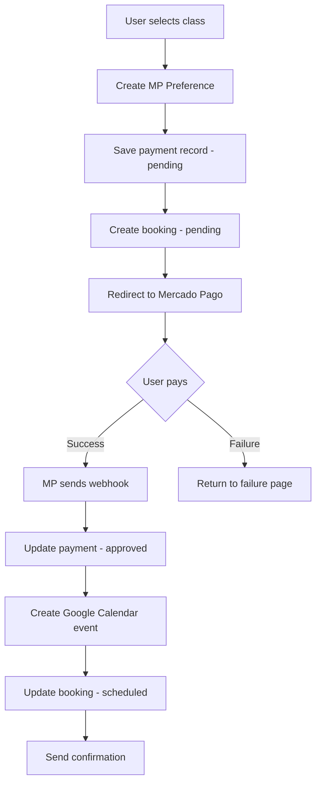

## Overview

Speak English Now uses Mercado Pago as the payment gateway for processing class bookings. The system handles payment preferences, webhooks for real-time updates, and automatic class creation upon successful payment.

## Payment Model

The `PaymentMercadoPago` model tracks all payment transactions:

<CodeGroup>
```prisma prisma/schema.prisma
enum PaymentStatus {
  approved
  pending
  rejected
}

model PaymentMercadoPago {
  id              String        @id @default(auto()) @map("_id") @db.ObjectId
  userId          String        @db.ObjectId
  preferenceId    String        @unique
  price           Int
  type            ClassType     // individual or grupal
  maxParticipants Int
  status          PaymentStatus @default(pending)
  user            User          @relation(fields: [userId], references: [id], onDelete: Cascade)
  createdAt       DateTime      @default(now())
  updatedAt       DateTime      @updatedAt
}
```
</CodeGroup>

<Note>
The `preferenceId` is unique and serves as the primary link between Mercado Pago's payment system and your database.
</Note>

## Payment Flow

The complete payment process follows these steps:



## Step 1: Create Payment Preference

When a user selects a class, create a Mercado Pago preference:

<CodeGroup>
```typescript api/mercado-pago/create-preference/route.ts
import { MercadoPagoConfig, Preference } from 'mercadopago';
import { auth } from '@/auth';
import { createPayment } from '@/services/functions';

export async function POST(request: NextRequest) {
  const body = await request.json();
  const session = await auth();
  const { type, studentsCount, price } = body;

  if (!session?.user) {
    throw new Error('User not authenticated');
  }

  // Initialize Mercado Pago client
  const client = new MercadoPagoConfig({ 
    accessToken: process.env.MERCADO_PAGO_ACCESS_TOKEN! 
  });
  const preference = new Preference(client);

  // Create preference body
  const mpBody = {
    items: [{
      id: `${session.user.id}-${Date.now()}`,
      title: `HablaInglesYa - Clase virtual para ${studentsCount} persona(s)`,
      quantity: 1,
      unit_price: price,
      currency_id: "ARS",
    }],
    notification_url: `${process.env.BASE_URL}api/mercado-pago/webhook`,
    payment_methods: {
      excluded_payment_types: [],
      excluded_payment_methods: [],
      installments: 12,  // Maximum installment options
    },
    back_urls: {
      success: `${process.env.BASE_URL}/checkout/callback/success`,
      failure: `${process.env.BASE_URL}/checkout/callback/failure`,
      pending: `${process.env.BASE_URL}/checkout/callback/pending`,
    },
    auto_return: "approved",
  };

  // Create preference in Mercado Pago
  const result = await preference.create({ body: mpBody });

  if (!result.id) {
    return NextResponse.json(
      { error: 'Failed to create preference' }, 
      { status: 500 }
    );
  }

  // Save payment record in database
  const data: PaymentMP = {
    userId: session.user.id,
    preferenceId: result.id,
    amount: Number(price),
    type: type,
    maxParticipants: Number(studentsCount),
    status: 'pending',
  };

  const paymentCreated = await createPayment(data);

  if (!paymentCreated?.success) {
    return NextResponse.json(
      { error: 'Failed to create payment record in our database' }, 
      { status: 500 }
    );
  }

  return NextResponse.json({ 
    preferenceId: result.id, 
    initPoint: result.init_point 
  });
}
```
</CodeGroup>

### Database Function

<CodeGroup>
```typescript services/functions/index.ts
export async function createPayment(data: PaymentMP) {
  try {
    const response = await db.paymentMercadoPago.create({
      data: {
        userId: data.userId,
        preferenceId: data.preferenceId,
        price: data.amount,
        type: data.type,
        maxParticipants: data.maxParticipants,
        status: data.status
      }
    });
    return { response, success: true };
  } catch (error) {
    console.error("Error creating payment record:", error);
    return { success: false };
  }
}
```
</CodeGroup>

## Step 2: Webhook Handling

Mercado Pago sends webhooks when payment status changes:

<CodeGroup>
```typescript api/mercado-pago/webhook/route.ts
import { updatePayment } from '@/services/functions';
import { KY, Method } from '@/services/api';
import { API_ROUTES } from '@/services/api/routes';

export async function POST(req: Request) {
  console.log("🚚 Webhook recibido!");

  const raw = await req.text();
  console.log("RAW BODY:", raw);

  let body: any = {};
  try {
    body = JSON.parse(raw);
  } catch {
    console.log("⚠ No se pudo parsear JSON. Continuamos...");
  }

  const topic = body?.topic;
  const resource = body?.resource;

  console.log("TOPIC", topic);

  // Ignore 'payment' topic (normal behavior)
  if (topic === "payment") {
    console.log("📬 Webhook 'payment' recibido. Ignorando (normal).");
    return Response.json({ ok: true });
  }

  // Handle 'merchant_order' topic
  if (topic === "merchant_order") {
    if (!resource) {
      console.log("⚠ Webhook sin resource URL");
      return Response.json({ ok: true });
    }

    console.log("📡 Consultando merchant_order:", resource);

    // Fetch merchant order details
    const orderRes = await fetch(resource, {
      headers: {
        Authorization: `Bearer ${process.env.MERCADO_PAGO_ACCESS_TOKEN}`,
      },
    });

    const order = await orderRes.json();
    console.log("📦 MERCHANT ORDER:", order);

    const payment = order.payments?.[0];
    if (!payment) {
      console.log("⚠ La orden no tiene pagos aún");
      return Response.json({ ok: true });
    }

    console.log("💳 PAYMENT:", payment);

    // Process approved payments
    if (payment.status === "approved") {
      console.log("✔ Pago aprobado, guardar en base de datos");
      const preferenceId = order.preference_id;
      
      // Update payment status
      const paymentFound = await updatePayment(preferenceId);

      if (paymentFound?.success) {
        console.log("✅ Pago actualizado en la base de datos");
        
        // Create Google Calendar event
        const url = normalizeUrl(process.env.BASE_URL!, API_ROUTES.CALENDAR);
        const isClassUpdated = await KY(Method.POST, url, {
          json: { preferenceId }
        });

        if (!isClassUpdated.success) {
          console.log("❌ Error al crear clase virtual después del pago");
          return Response.json({ ok: false, status: 500 });
        }
      } else {
        console.log("❌ Error al actualizar el pago en la base de datos");
      }
    }

    return Response.json({ ok: true, status: 200 });
  }
  
  // Other events
  console.log("⚠ Webhook desconocido, ignorando");
  return Response.json({ ok: true });
}
```
</CodeGroup>

<Info>
**Webhook Security**: Unlike Stripe, Mercado Pago does not sign webhook payloads. Always verify payment status by fetching the merchant order from Mercado Pago's API using the resource URL.
</Info>

### Update Payment Status

<CodeGroup>
```typescript services/functions/index.ts
export async function updatePayment(preferenceId: string) {
  try {
    const response = await db.paymentMercadoPago.update({
      where: { preferenceId },
      data: { status: 'approved' }
    });
    return { response, success: true };
  } catch (error) {
    console.error("Error updating payment:", error);
    return { success: false };
  }
}
```
</CodeGroup>

## Step 3: Callback Pages

After payment, users are redirected to status-specific callback pages:

<CodeGroup>
```tsx checkout/callback/[status]/page.tsx
"use client"
import { useSearchParams } from "next/navigation";
import { Card } from "@/components/ui/card";
import useConfetti from "@/hooks/useConfetti";

export default function CallbackPage() {
  const searchParams = useSearchParams();
  const paymentId = searchParams.get("payment_id");
  const externalReference = searchParams.get("external_reference");
  const status = searchParams.get("status");
  const { seconds } = useConfetti({ status: status! });

  return (
    <div className="flex flex-col items-center justify-center min-h-screen">
      {status === "approved" && (
        <Card className="w-full max-w-5xl py-16 px-16 space-y-12">
          <h1 className="text-4xl font-bold text-green-600">
            ¡Tu pago fue exitoso!
          </h1>
          <div className="flex flex-col items-center space-y-4">
            <p>ID de pago: {paymentId}</p>
            <p>Referencia: {externalReference}</p>
          </div>
          <p className="font-bold">
            Serás redirigido a la aplicación en {seconds} segundos
          </p>
        </Card>
      )}
      
      {status === "failure" && (
        <>
          <h1 className="text-3xl font-bold text-red-600">El pago falló</h1>
          <p>Intentá nuevamente más tarde.</p>
        </>
      )}

      {status === "pending" && (
        <>
          <h1 className="text-3xl font-bold text-yellow-600">
            Pago pendiente
          </h1>
          <p>Estamos procesando tu transacción.</p>
        </>
      )}
    </div>
  );
}
```
</CodeGroup>

### URL Parameters

Mercado Pago redirects with these query parameters:

<CodeGroup>
```
https://yourdomain.com/checkout/callback/success?
status=approved
&collection_status=approved
&preference_id=162275027-fe8b544b-ea47-471f-8f0d-3126b2640895
&site_id=MLA
&external_reference=
&collection_id=133649831763
&payment_id=133649831763
&payment_type=account_money
&processing_mode=aggregator
&merchant_order_id=3566848058
```
</CodeGroup>

## Pricing Configuration

Prices are configured in a JSON file:

<CodeGroup>
```json config/pricing.json
{
  "basePrice": 15000,
  "groupPrice": 12000,
  "perStudent": {
    "2": 30000,
    "3": 36000,
    "4": 48000,
    "5": 60000
  },
  "openClassPrice": 6000,
  "currency": "ARS"
}
```
</CodeGroup>

<Tabs>
  <Tab title="Individual Classes">
    **Base Price**: 15,000 ARS
    - One-on-one instruction
    - Personalized curriculum
    - Flexible scheduling
  </Tab>
  <Tab title="Group Classes">
    **Per Student Pricing**:
    - 2 students: 30,000 ARS (15,000 per student)
    - 3 students: 36,000 ARS (12,000 per student)
    - 4 students: 48,000 ARS (12,000 per student)
    - 5 students: 60,000 ARS (12,000 per student)
  </Tab>
  <Tab title="Open Classes">
    **Open Class Price**: 6,000 ARS
    - Join existing group sessions
    - Topic-based classes
    - Community learning
  </Tab>
</Tabs>

## Environment Variables

Required environment variables for Mercado Pago integration:

<CodeGroup>
```bash .env
# Mercado Pago
MERCADO_PAGO_ACCESS_TOKEN=your_access_token_here
BASE_URL=https://yourdomain.com/

# Optional: For testing
MERCADO_PAGO_PUBLIC_KEY=your_public_key_here
```
</CodeGroup>

<Note>
Get your Mercado Pago credentials from the [Mercado Pago Dashboard](https://www.mercadopago.com.ar/developers/panel).
</Note>

## Webhook Configuration

### Setup in Mercado Pago Dashboard

1. Go to [Mercado Pago Developers Panel](https://www.mercadopago.com.ar/developers/panel)
2. Navigate to "Webhooks" section
3. Add webhook URL: `https://yourdomain.com/api/mercado-pago/webhook`
4. Select events to listen to:
   - ✅ `merchant_order` (recommended)
   - ❌ `payment` (optional, usually ignored)

### Local Testing with ngrok

<CodeGroup>
```bash Terminal
# Install ngrok
npm install -g ngrok

# Start your dev server
npm run dev

# In another terminal, expose localhost
ngrok http 3000

# Use the ngrok URL in Mercado Pago dashboard
https://abc123.ngrok.io/api/mercado-pago/webhook
```
</CodeGroup>

## Payment Status Flow

<CodeGroup>
```typescript Payment State Machine
type PaymentStatus = 'pending' | 'approved' | 'rejected';

// Initial state: pending
const payment = await createPayment({
  status: 'pending',
  // ... other fields
});

// After webhook: approved or rejected
if (webhookPayment.status === 'approved') {
  await updatePayment(preferenceId);
  await createGoogleCalendarEvent(preferenceId);
} else if (webhookPayment.status === 'rejected') {
  // Handle rejected payment
  await notifyUserOfFailure(userId);
}
```
</CodeGroup>

## Error Handling

<Card title="Common Issues" icon="warning">

**Webhook not receiving events**
- Verify webhook URL is publicly accessible
- Check Mercado Pago dashboard for webhook status
- Ensure HTTPS in production (HTTP allowed for testing)

**Payment approved but class not created**
- Check webhook logs for errors
- Verify Google Calendar API credentials
- Ensure `preferenceId` matches between payment and booking

**Duplicate payments**
- Use `preferenceId` as unique constraint
- Implement idempotency in webhook handler
- Check for race conditions in concurrent requests

</Card>

## Testing Payments

Mercado Pago provides test cards for development:

<CodeGroup>
```javascript Test Cards
// Approved payment
Card: 5031 7557 3453 0604
Expiry: 11/25
CVV: 123
Name: APRO

// Pending payment
Card: 5031 7557 3453 0604
Expiry: 11/25
CVV: 123
Name: PEND

// Rejected payment
Card: 5031 7557 3453 0604
Expiry: 11/25
CVV: 123
Name: REJE
```
</CodeGroup>

<Info>
Use test credentials from the Mercado Pago dashboard when testing. Switch to production credentials before going live.
</Info>

## Security Best Practices

<Card title="Security Checklist" icon="shield">

✅ **Always verify payment status** by fetching from Mercado Pago API, not trusting webhook data alone

✅ **Use HTTPS** for webhook endpoints in production

✅ **Store access tokens** in environment variables, never in code

✅ **Validate user authentication** before creating preferences

✅ **Implement rate limiting** on payment endpoints

✅ **Log all webhook events** for audit trail

✅ **Handle webhook retries** idempotently (Mercado Pago may send duplicates)

</Card>

## Integration with Virtual Classes

After successful payment, the system automatically:

1. Updates payment status to `approved`
2. Creates Google Calendar event (see [Calendar Integration](/features/calendar-integration))
3. Updates booking status to `scheduled`
4. Generates access code for participants
5. Sends confirmation email (if configured)

<CodeGroup>
```typescript Complete Flow
// 1. User books class
const preference = await createPreference({ type, studentsCount, price });
const booking = await createBooking({ preferenceId: preference.id, ... });

// 2. User pays on Mercado Pago
// 3. Webhook received

// 4. Update payment
await updatePayment(preferenceId);

// 5. Create calendar event
const calendarEvent = await createGoogleCalendarEvent(preferenceId);

// 6. Update booking with meeting link
await updateVirtualClass(calendarEvent, booking);
```
</CodeGroup>

## API Reference

### Create Preference

<CodeGroup>
```typescript
POST /api/mercado-pago/create-preference

Headers:
  Authorization: Bearer <session-token>

Body:
{
  "type": "individual" | "grupal",
  "studentsCount": number,
  "price": number
}

Response:
{
  "preferenceId": "162275027-fe8b544b",
  "initPoint": "https://www.mercadopago.com.ar/checkout/v1/redirect?pref_id=..."
}
```
</CodeGroup>

### Webhook Endpoint

<CodeGroup>
```typescript
POST /api/mercado-pago/webhook

Headers:
  Content-Type: application/json

Body (Mercado Pago sends):
{
  "topic": "merchant_order",
  "resource": "https://api.mercadopago.com/merchant_orders/3566848058"
}

Response:
{
  "ok": true,
  "status": 200
}
```
</CodeGroup>

## Related Features

- [Virtual Classes](/features/virtual-classes) - Class booking and management
- [Calendar Integration](/features/calendar-integration) - Google Calendar event creation
- [Learning Activities](/features/learning-activities) - Post-payment activity access